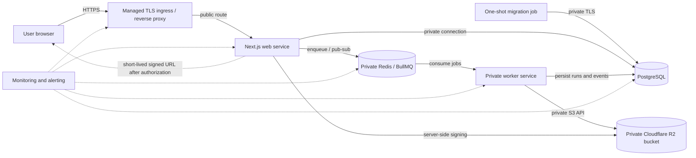

# Production architecture

Wakil deploys as three immutable application targets: a public web service, a private queue worker,
and a one-shot database migration job. PostgreSQL is the durable source of truth. Redis transports
queue jobs, live events, and rate-limit coordination. Cloudflare R2 stores private immutable
artifacts; only the web and worker receive bucket-scoped credentials.

## Network and persistence boundaries

| Component       | Exposure                    | Persistent state                          | Health                           |
| --------------- | --------------------------- | ----------------------------------------- | -------------------------------- |
| Managed ingress | public HTTPS only           | provider configuration                    | external HTTPS probe             |
| Web             | reachable only from ingress | none; ephemeral filesystem                | `/api/health`, `/api/ready`      |
| Worker          | private network only        | none; ephemeral filesystem                | `/health`, `/ready` on port 3001 |
| Migration job   | private, no listener        | committed migration history in PostgreSQL | exit code                        |
| PostgreSQL      | private network/TLS only    | durable database and backups              | provider/database probe          |
| Redis/BullMQ    | private network/TLS only    | AOF/managed persistence for queued work   | `PING`, queue metrics            |
| Cloudflare R2   | private S3 API              | durable artifacts and backup copy         | server-side operation metrics    |

The worker never starts inside the web process. The web enqueues a `runId`-keyed job; PostgreSQL
holds the durable run/event state and idempotency records. Redis loss may interrupt transport but
must not erase visible run history. Failed BullMQ records are retained for seven days or 1,000 jobs,
whichever bound is reached. Worker concurrency is explicit and defaults to four. BullMQ handles
stalled-job recovery; the database run state machine and per-run job ID bound duplicate execution.

## Service operation

- Build images from the repository `Dockerfile` targets `web`, `worker`, and `migrate` using the
  same commit SHA. All runtime targets use Node.js 22.23.1 and a non-root user.
- Run `migrate` exactly once before making the new web/worker revision ready. Never let web and
  worker run migrations on startup.
- Route only web port 3000 through a TLS ingress. Worker port 3001, PostgreSQL, and Redis remain on
  private networks. R2 public development URLs and custom domains remain disabled.
- Liveness checks only process response. Readiness checks PostgreSQL/Redis connectivity (web) or the
  established queue consumer (worker) and expose no dependency error detail.
- Web and worker stop on `SIGTERM`; the worker marks itself unready, waits for active BullMQ jobs to
  close, and releases Redis/PostgreSQL connections. Configure a termination grace period longer than
  the bounded job duration (recommended 10 minutes).

## Redis production settings

- Prefer managed Redis reachable through private networking; use `rediss://` when TLS is required.
- Require authentication, a five-second-or-lower connection timeout, and provider-side reconnects.
- Use a dedicated production instance or namespace; never share queue keys with development or
  staging. The current queue is named `wakil-runs`.
- Disable volatile eviction for queue data. Prefer `noeviction`; size the instance and alert before
  memory exhaustion. If self-hosted, enable AOF (`appendonly yes`) and persist `/data`.
- Do not treat Redis as the only record of a run. PostgreSQL remains authoritative after Redis
  restart, and operators must reconcile queued/running database rows after an incident.

## Deployment-platform boundary

No production platform or registry is selected and no deployment credentials are present. The
repository therefore provides provider-neutral OCI images, Compose topology, health contracts, and a
protected manual preflight—not a deployment workflow. The selected platform must provide TLS
ingress, secret injection, private networking, immutable revision rollback, log/metric collection,
and a one-shot pre-release migration job.
